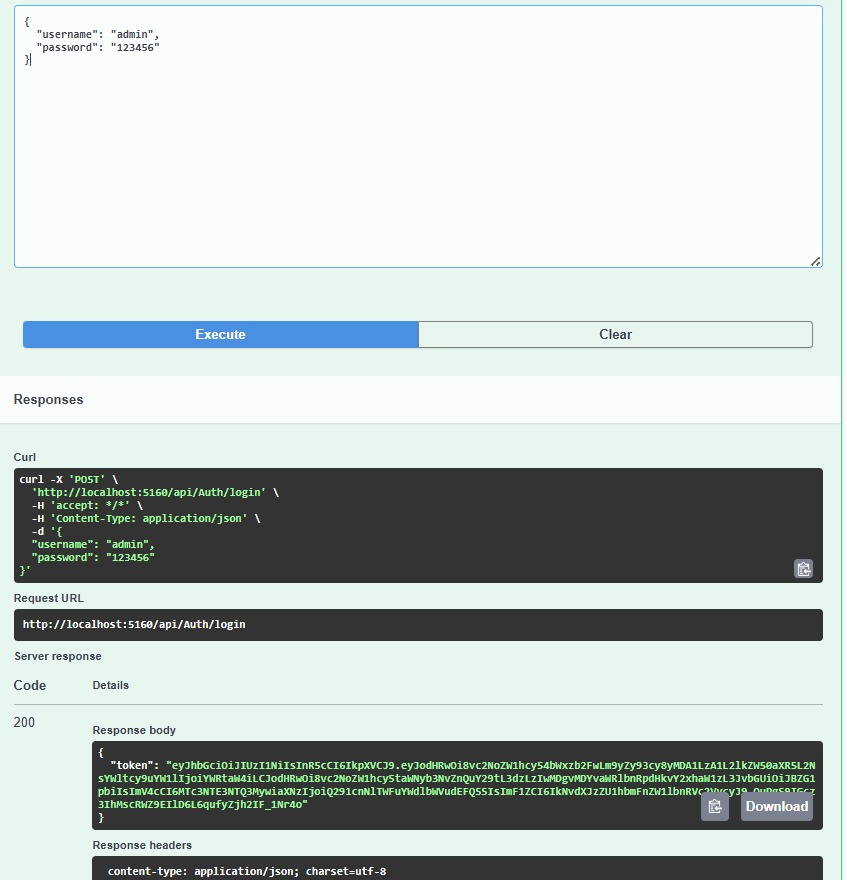
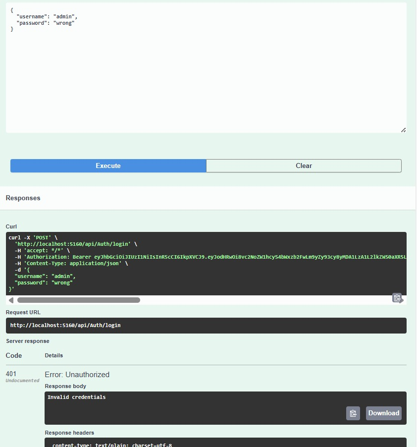
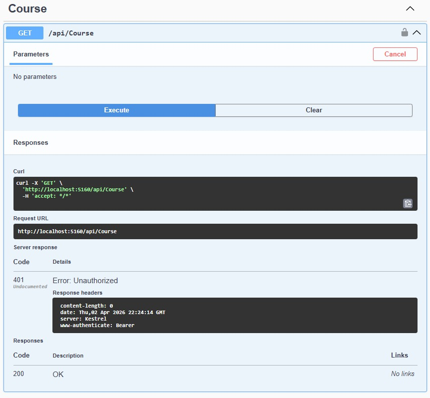
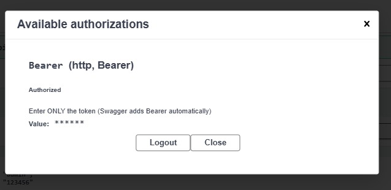
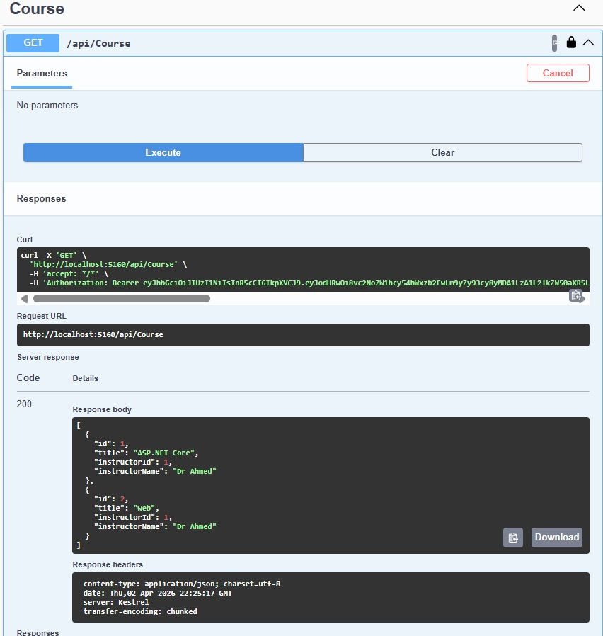
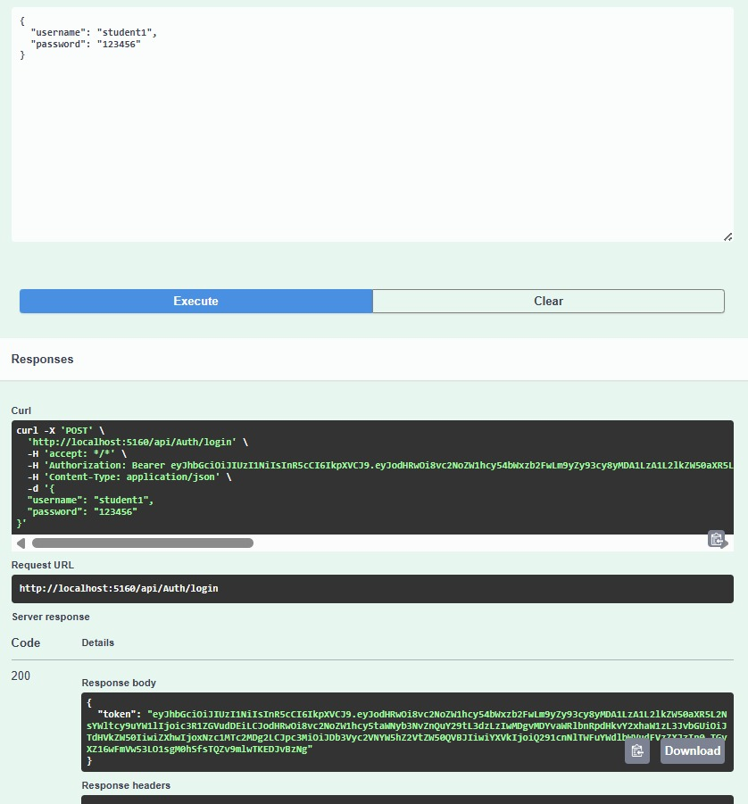
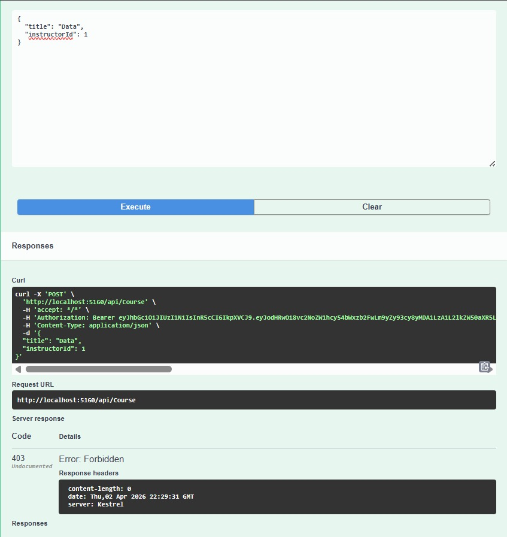
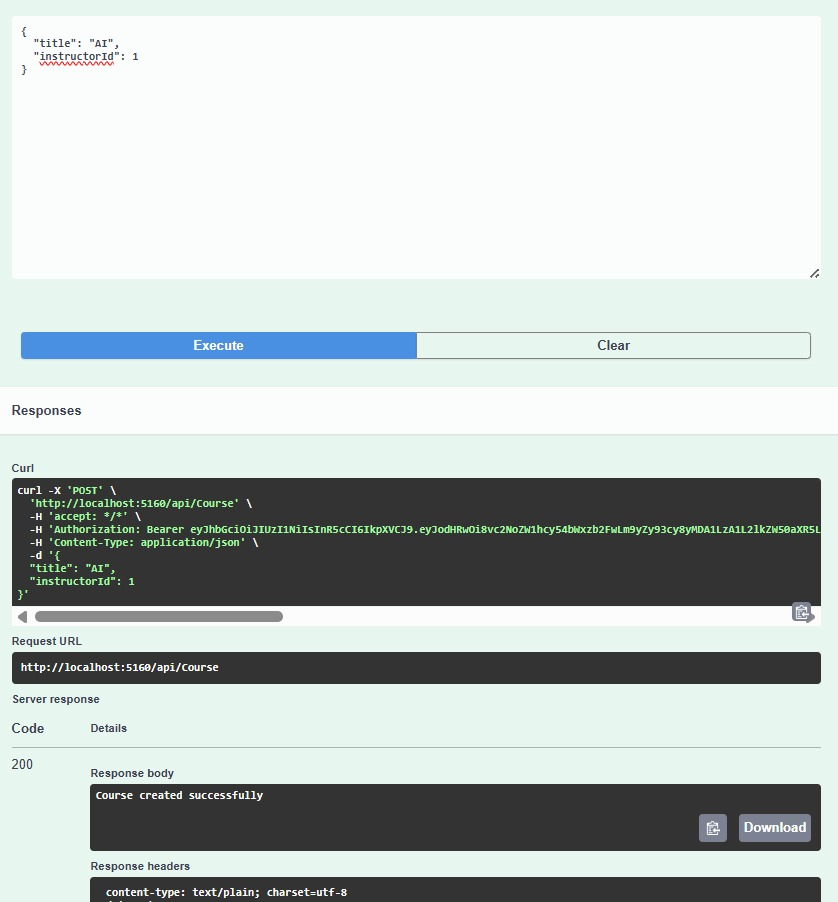
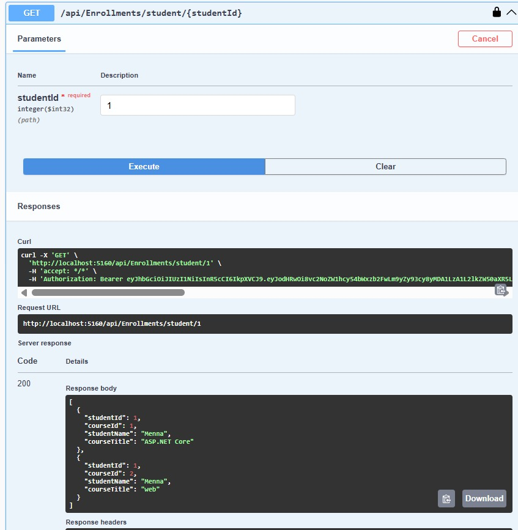
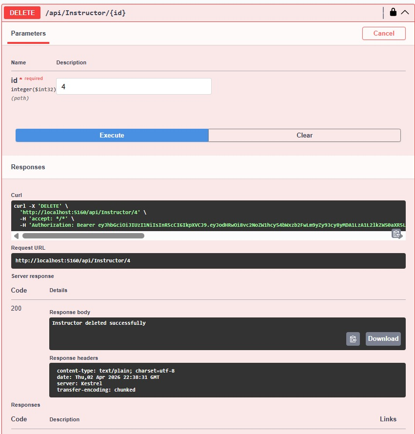

# Course Management System API

## Project Description

The **Course Management System API** is a RESTful Web API built using **ASP.NET Core** and **Entity Framework Core**.
The system manages university courses, students, instructors, instructor profiles, and enrollments.

This project demonstrates the implementation of:

* Entity relationships
* Dependency Injection
* Service layer architecture
* DTO usage with validation
* JWT Authentication
* Role-based Authorization
* LINQ query optimization
* AsNoTracking() performance optimization
* Swagger API documentation

This assignment serves as the foundation for the final course project.

---

# Technologies Used

## ASP.NET Core Web API

Used to build RESTful endpoints for handling HTTP requests such as GET, POST, PUT, and DELETE.

## Entity Framework Core

Used as the ORM (Object Relational Mapper) to communicate with SQL Server and manage database relationships.

## SQL Server

Used as the relational database to store application data.

## Dependency Injection

Used to inject database context and services into controllers for clean architecture.

## JWT Authentication

Used to authenticate users securely and generate access tokens after login.

## Role-Based Authorization

Used to restrict access to certain endpoints depending on user roles such as Admin, Instructor, and Student.

## Swagger (OpenAPI)

Used to document API endpoints and test requests directly from the browser.

---

# System Entities

The system includes the following main entities:

* Student
* Instructor
* Course
* InstructorProfile
* Enrollment
* User (Authentication entity)

---

# Entity Relationships

The following relationships are implemented using Entity Framework Core:

## One-to-One Relationship

Instructor → InstructorProfile

Each instructor has exactly one profile containing additional information.

## One-to-Many Relationship

Instructor → Courses

Each instructor can teach multiple courses.

## Many-to-Many Relationship

Student ↔ Course (via Enrollment table)

Students can enroll in multiple courses, and courses can contain multiple students.

---

# Service Layer Architecture

The system implements a service layer between controllers and database context.

Implemented services:

* CourseService
* StudentService
* InstructorService
* EnrollmentService
* JwtService

Services use **Dependency Injection** to access the database context.

Controllers do NOT communicate directly with the database.

---

# DTO Implementation

DTOs (Data Transfer Objects) are used to separate API request/response models from database entities.

Implemented DTO types:

## Create DTOs

Example:

CreateCourseDto

Used when creating new records.

## Update DTOs

Example:

UpdateCourseDto

Used when updating existing records.

## Read DTOs

Example:

CourseDto

Returned from API instead of entity models.

Controllers never return entity models directly.

---

# DTO Validation

DTO validation is implemented using Data Annotation attributes:

Examples:

* Required
* MaxLength
* MinLength
* Range
* EmailAddress

Invalid requests return:

HTTP 400 Bad Request

Validation occurs before database operations.

---

# Authentication

JWT Authentication is implemented.

Authentication flow:

1. User sends username and password
2. Server validates credentials
3. Server generates JWT token
4. Client sends token in Authorization header

Example header:

```
Authorization: Bearer YOUR_TOKEN
```

Authentication endpoint:

```
POST /api/Auth/login
```

---

# Authorization

Role-Based Authorization is implemented using:

```
[Authorize]
```

and

```
[Authorize(Roles = "Admin")]
```

Example roles:

* Admin
* Instructor
* Student

Only Admin users can:

* Create courses
* Update courses
* Delete courses

Other users can only view data.

---

# LINQ Query Optimization

LINQ Select() projections are used to return only required fields.

Example:

```
_context.Courses
.AsNoTracking()
.Select(c => new CourseDto
{
    Id = c.Id,
    Title = c.Title
})
```

This improves performance and reduces memory usage.

---

# AsNoTracking Performance Optimization

All read-only queries use:

```
AsNoTracking()
```

This improves performance because Entity Framework does not track returned objects.

---

# Async Database Operations

Async methods are used for database access:

Examples:

```
ToListAsync()
FirstOrDefaultAsync()
SaveChangesAsync()
```

This improves application performance and scalability.

---

# Database Migrations

Entity Framework Core migrations are used to create and update the database schema.

Example commands:

```
dotnet ef migrations add InitialCreate
dotnet ef database update
```

---

# Swagger API Documentation

Swagger is integrated for testing and documenting API endpoints.

Swagger allows:

* Testing endpoints
* Sending tokens
* Viewing request/response models

Swagger runs automatically when the project starts.

---

# How to Run the Project

Follow these steps:

1. Clone repository

```
git clone REPOSITORY_URL
```

2. Navigate to project folder

```
cd CourseManagementAPI
```

3. Update connection string inside:

```
appsettings.json
```

4. Apply migrations

```
dotnet ef database update
```

5. Run project

```
dotnet run
```

6. Open Swagger

```
http://localhost:xxxx/swagger
```

---

# Example Test Users

The following seeded users are available:

Admin:

```
username: admin
password: 123456
```

Instructor:

```
username: instructor1
password: 123456
```

Student:

```
username: student1
password: 123456
```

---

# Why HTTP-Only Cookies Are Industry Standard

HTTP-only cookies are commonly used in production authentication systems because they:

* Prevent JavaScript access to authentication tokens
* Protect against Cross-Site Scripting (XSS) attacks
* Automatically attach to requests securely
* Reduce token exposure in browser storage

Although this project uses JWT tokens in Authorization headers for simplicity, production systems often store authentication tokens inside HTTP-only cookies for enhanced security.

---

# API Endpoint Examples

This section demonstrates example API requests and responses using Swagger.

All protected endpoints require a JWT token in:

Authorization: Bearer YOUR_TOKEN

--------------------------------------------------

## Authentication

### Login

POST `/api/Auth/login`

Request Body Example:

```json
{
  "username": "admin",
  "password": "123456"
}
```

Response Example:

```json
{
  "token": "JWT_TOKEN_HERE"
}
```

--------------------------------------------------

## Courses Endpoints

### Get All Courses

GET `/api/Course`

Authorization Required: Yes

Response Example:

```json
[
  {
    "id": 2,
    "title": "Web",
    "instructorId": 1,
    "instructorName": "Dr Ahmed"
  }
]
```

---

### Create Course (Admin only)

POST `/api/Course`

Request Body Example:

```json
{
  "title": "AI",
  "instructorId": 1
}
```

Response Example:

```
Course created successfully
```

---

### Update Course (Admin only)

PUT `/api/Course/{id}`

Example:

PUT `/api/Course/1`

Request Body Example:

```json
{
  "title": "Machine Learning",
  "instructorId": 1
}
```

Response Example:

```
Course updated successfully
```

---

### Delete Course (Admin only)

DELETE `/api/Course/{id}`

Example:

DELETE `/api/Course/1`

Response Example:

```
Course deleted successfully
```

--------------------------------------------------

## Students Endpoints

### Get All Students

GET `/api/Student`

Response Example:

```json
[
  {
    "id": 1,
    "name": "Menna",
    "email": "menna@test.com"
  }
]
```

---

### Create Student

POST `/api/Student`

Request Body Example:

```json
{
  "name": "Menna",
  "email": "menna@test.com"
}
```

Response Example:

```
Student created successfully
```

---

### Update Student

PUT `/api/Student/{id}`

Example:

PUT `/api/Student/1`

Request Body Example:

```json
{
  "name": "Yara",
  "email": "yara@test.com"
}
```

Response Example:

```
Student updated successfully
```

---

### Delete Student

DELETE `/api/Student/{id}`

Example:

DELETE `/api/Student/1`

Response Example:

```
Student deleted successfully
```

--------------------------------------------------

## Instructors Endpoints

### Get All Instructors

GET `/api/Instructor`

Response Example:

```json
[
  {
    "id": 1,
    "name": "Dr Ahmed",
    "email": "ahmed@test.com"
  }
]
```

---

### Create Instructor

POST `/api/Instructor`

Request Body Example:

```json
{
  "name": "Dr Ahmed",
  "email": "ahmed@test.com"
}
```

Response Example:

```
Instructor created successfully
```

---

### Delete Instructor

DELETE `/api/Instructor/{id}`

Example:

DELETE `/api/Instructor/1`

Response Example:

```
Instructor deleted successfully
```

--------------------------------------------------

## Enrollment Endpoints (Many-to-Many Relationship)

### Enroll Student in Course

POST `/api/Enrollment`

Request Body Example:

```json
{
  "studentId": 1,
  "courseId": 1
}
```

Response Example:

```
Enrollment created successfully
```

---

### Get Courses for Student

GET `/api/Enrollments/student/{studentId}`

Example:

GET `/api/Enrollments/student/1`

Response Example:

```json
[
  {
    "studentId": 1,
    "courseId": 2,
    "studentName": "Menna",
    "courseTitle": "Web"
  }
]
```

---

### Get Students in Course

GET `/api/Enrollments/course/{courseId}`

Example:

GET `/api/Enrollments/course/1`

Response Example:

```json
[
  {
    "studentId": 1,
    "courseId": 3,
    "studentName": "Menna",
    "courseTitle": "AI"
  }
]
```

---

### Delete Enrollment

DELETE `/api/Enrollment/{studentId}/{courseId}`

Example:

DELETE `/api/Enrollment/1/1`

Response Example:

```
Enrollment deleted successfully
```

# Screenshots

* Successful Login and JWT Token Generation


* Invalid Login Attempt (Unauthorized Access)


* Access Denied Without Authentication Token


* Swagger Authorization Using JWT Token


* Retrieve Courses After Authentication


* Successful Student Login and JWT Token Generation



* Role-Based Authorization Restricting Student Access


* Admin Creating Course Successfully


* Many-to-Many Relationship Between Students and Courses


* Delete Instructor Using Protected Endpoint



Swagger screenshots demonstrate:

* Successful login
* Unauthorized access without token
* Authorized access with token
* Role-based authorization restrictions
* DTO validation errors
* CRUD operations working successfully
